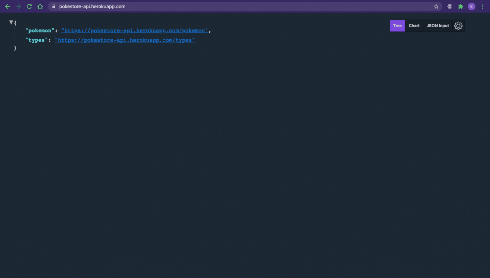

<h1 align=center></img></h1>
<h1 align=center></img></h1>
 
This project is a Pokemon Store Api. Got data from <a href="https://pokeapi.co/">PokeApi</a>, customized with a price property and created new resources. 
<strong>Create your own Pokestore and enjoy. Gotta catch’em all! :)</strong>
 

## 🧩 Tecnologies

<ul>
<li><a href="https://expressjs.com/">Express.js</a> </li>
<li><a href="https://www.typescriptlang.org/">Typescript</a> </li>
<li><a href="https://axios-http.com/">Axios</a> </li>
<li><a href="https://www.mongodb.com/cloud/atlas">MongoDB Atlas</a> </li>
<li><a href="https://mongoosejs.com/">Mongoose</a> </li>
</ul> 

## 🛣️ Routes

<ul>
<li><a href="https://pokestore-api.herokuapp.com/pokemon">Pokemon Route</a></li>
<li><a href="https://pokestore-api.herokuapp.com/types">Type Route</a></li>
</ul> 

## 🚀 Resources

<ol>
<li><strong>
Pagination
</strong></li> 

https://pokestore-api.herokuapp.com/pokemon?<strong>offset</strong>=20&<strong>limit</strong>=20
 

You can see and navigate the API through the Pagination Resource. The <strong>Offset</strong> means the Pokemon Index and <strong>Limit</strong> is how many Pokemon will appear in the page. You can change the URL to customize the Limit and Offset. Also, you have the <strong>Next</strong> and <strong>Previous</strong> to navigate throught the Api more efficiently. This resource also works in the <strong>Type Route</strong>.
 

<li><strong>
Search Pokemon
</strong></li> 

https://pokestore-api.herokuapp.com/pokemon/<strong>bulbasaur || 1 (key)</strong>
 

You can search the Pokemon by adding a <strong>Paramater</strong> after the Pokemon Route. The parameter should be the Pokemon name or key values. If you type the incomplete name, the Api will still show the possible matches. The Pagination still works in this resource.
 

https://pokestore-api.herokuapp.com/type/<strong>grass</strong>/pokemon/<strong>bulbasaur || 1 (key)</strong>
 

The same occurs in the type route!
 

<li><strong>
Order Page
</strong></li> 
https://pokestore-api.herokuapp.com/pokemon?offset=20&limit=20&<strong>order</strong>=name || key || any
 

You can set the wanted order to display the Pokemon using any Pokemon Parameters and they will show the Pokemon in a ascending order. However, the next, previous and orderBy(Name || Key), only works with the key or name properties. To use another property besides those, you will need to set this directly on Fetch. This resource also work in the <strong>Type Route</strong>. 

</ol>
